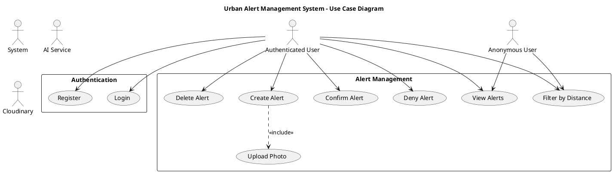

# 📊 UML Diagrams - How to View

This project includes comprehensive UML diagrams in **PlantUML** format.

## 📁 Files Created

1. **UML_ANALYSIS.md** - Complete textual analysis of actors and actions
2. **UML_DIAGRAMS.puml** - All UML diagrams in PlantUML format
3. **UML_DIAGRAMS_README.md** - This file (viewing instructions)

---

## 🎨 Diagrams Included

### 1. **Use Case Diagram**
- Shows all actors (Authenticated User, Anonymous User, System, AI Service, Cloudinary)
- All use cases organized by module
- Relationships between actors and use cases

### 2. **Sequence Diagrams**
- **Create Alert** - Shows complete flow including duplicate detection
- **Confirm Alert** - Shows trust system and confidence calculation
- **AI Chat** - Shows interaction with Python AI service and Ollama

### 3. **State Diagram**
- Alert status transitions (ACTIVE → VERIFIED/REJECTED/EXPIRED)
- Final states and conditions for transitions

### 4. **Class Diagram**
- Core domain models (User, Alert, ChatMessage)
- Services (AuthService, AlertsService, UsersService, etc.)
- Enumerations (AlertType, AlertStatus, MessageRole)
- Relationships between classes

### 5. **Component Diagram**
- System architecture showing Frontend, Backend, AI Service
- External services (MongoDB, Cloudinary, Ollama)
- Communication patterns

### 6. **Activity Diagram**
- Duplicate alert detection algorithm flow
- Decision points and loops

### 7. **Deployment Diagram**
- Production environment setup
- Server distribution (Vercel, Railway)
- Database and external service connections

---

## 🖥️ How to View the Diagrams

### Option 1: Online PlantUML Editor (Easiest)
1. Go to **[PlantUML Online Server](http://www.plantuml.com/plantuml/uml/)**
2. Open `UML_DIAGRAMS.puml`
3. Copy a diagram section (between `@startuml` and `@enduml`)
4. Paste into the online editor
5. View the rendered diagram

### Option 2: VS Code Extension (Recommended for Development)
1. Install **PlantUML** extension in VS Code:
   - Open Extensions (Ctrl+Shift+X)
   - Search for "PlantUML"
   - Install by jebbs

2. Install Java (required by PlantUML):
   - Download from [java.com](https://www.java.com/download/)
   - Or use: `choco install openjdk` (Windows)

3. Install Graphviz (required for rendering):
   - Download from [graphviz.org](https://graphviz.org/download/)
   - Or use: `choco install graphviz` (Windows)

4. View diagrams:
   - Open `UML_DIAGRAMS.puml` in VS Code
   - Press **Alt+D** to preview
   - Or right-click → "Preview Current Diagram"

### Option 3: PlantUML CLI (For Exporting Images)
1. Install Java and Graphviz (see Option 2)

2. Download PlantUML JAR:
   ```bash
   curl -o plantuml.jar https://sourceforge.net/projects/plantuml/files/plantuml.jar/download
   ```

3. Generate PNG images:
   ```bash
   java -jar plantuml.jar UML_DIAGRAMS.puml
   ```
   This creates PNG files for each diagram.

4. Generate SVG images (scalable):
   ```bash
   java -jar plantuml.jar -tsvg UML_DIAGRAMS.puml
   ```

### Option 4: Online Tools (Quick View)
- **PlantText**: https://www.planttext.com/
- **PlantUML Viewer**: https://plantuml-editor.kkeisuke.com/
- **Gravizo**: http://g.gravizo.com/

---

## 📋 Diagram List

Copy these sections individually to view:

1. **Use_Case_Diagram** - Lines 1-90
2. **Sequence_Create_Alert** - Lines 92-220
3. **Sequence_Confirm_Alert** - Lines 222-360
4. **Sequence_AI_Chat** - Lines 362-410
5. **State_Diagram_Alert** - Lines 412-450
6. **Class_Diagram** - Lines 452-600
7. **Component_Diagram** - Lines 602-690
8. **Activity_Duplicate_Detection** - Lines 692-760
9. **Deployment_Diagram** - Lines 762-820

---

## 🎯 Quick Start (Easiest Method)

1. **Copy this entire block for Use Case Diagram:**



2. **Paste into [PlantUML Online](http://www.plantuml.com/plantuml/uml/)**

3. **View rendered diagram!**

---

## 📸 Export Diagrams as Images

If using VS Code with PlantUML extension:

1. Open `UML_DIAGRAMS.puml`
2. Right-click on diagram
3. Select "Export Current Diagram"
4. Choose format: PNG, SVG, PDF, etc.

---

## 🔗 Useful Resources

- **PlantUML Documentation**: https://plantuml.com/
- **PlantUML Guide**: https://plantuml.com/guide
- **Real World PlantUML**: https://real-world-plantuml.com/
- **UML Tutorial**: https://www.tutorialspoint.com/uml/

---

## 📖 Understanding the Diagrams

### Use Case Diagram
- **Actors**: External entities interacting with system
- **Use Cases**: Functionalities provided by system
- **Relationships**: 
  - Solid arrow: Actor performs use case
  - Dotted arrow with <<include>>: Required dependency
  - Dotted arrow with <<extend>>: Optional extension

### Sequence Diagram
- **Vertical axis**: Time flows downward
- **Horizontal axis**: Different components/actors
- **Arrows**: Messages/calls between components
- **Activation boxes**: When component is processing

### State Diagram
- **Rounded rectangles**: States
- **Arrows**: Transitions
- **Labels on arrows**: Conditions for transition
- **[*]**: Start/end points

### Class Diagram
- **Boxes**: Classes with attributes and methods
- **Lines**: Relationships
  - Solid line: Association
  - Diamond: Composition/Aggregation
  - Dotted arrow: Dependency
  - Triangle arrow: Inheritance

---

## 💡 Tips

1. **View one diagram at a time** for better clarity
2. **Use online editor** for quick viewing without installation
3. **Export as SVG** for best quality (scalable)
4. **Print to PDF** for documentation purposes
5. **Zoom in/out** to see details in complex diagrams

---

## 🆘 Troubleshooting

### Diagram not rendering?
- Check Java is installed: `java -version`
- Check Graphviz is installed: `dot -version`
- Restart VS Code after installing extensions

### Syntax errors?
- Ensure you copied complete diagram (from `@startuml` to `@enduml`)
- Check for missing parentheses or quotes
- Validate online first

### Slow rendering?
- Large diagrams take time
- Try online editor for quick preview
- Simplify diagram if too complex

---

*For questions about the system design, refer to UML_ANALYSIS.md*

